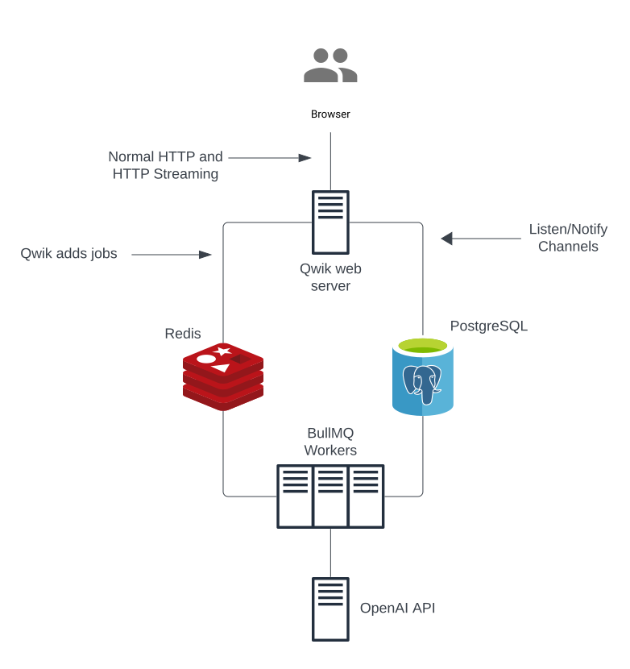

In this post I'll describe how the following all-JavaScript application stack excells with language model (LM) heavy workloads:

- [Qwik](https://qwik.builder.io/): A cutting edge, high performance web application framework;
- [BullMQ](https://bullmq.io/): Background job processing;
- [Redis](https://redis.io/): in-memory datastore;
- [PostgreSQL](https://www.postgresql.org/): relational, persistant database;
- [OpenAI API](https://openai.com/): language model API.



This is a high level architecture overview. I provide some code snippets for illustrative purposes. The code snippets are not copy/paste production code.

## Using LMs to provide legal advice
Imagine an LM based application that can give legal advice to startups. Let's say a startup accidentally hired the wrong person into a C-Suite role and needs to do a termination. How do they go about that?

First, the application needs to determine how to answer this question. Let's imagine we have a dataset of legal analysis the app can use for this. We make several LM calls to determine the parameters to search the dataset. Then we use the LM to determine if the search results are relevant to the question. Next we use the language model to review the data and determine what facts it needs to provide an answer. For this example, the LM will have 10-15 questions about employee demographics, equity grant details, and the reason for the termination. For each question, we again use the LM to determine which facts can be gathered programatically from APIs (e.g. employee demographics from the company's Rippling HR system; equity info from the company's Carta account) and which have to be answered by a human (the reason for the termination).

We use the LM to create the API requests and to craft a question to the human. Then we use the LM convert it into the correct format for the database. Finally, we make one last LM call providing the question, the facts we gathered, and relevant legal analysis from our dataset to generate the advice. This last request generates a lot of text and easily takes over 30 seconds on its own. All-in-all we made about 50 requests to various LMs via the OpenAI API to generate some legal advice.

## The challenges of working with LMs
There are a few key challenges with building applications on top of LM APIs. These are not novel challenges in software engineering, but they are a bit different than your typical application.

The first challenge is that LMs can be slow. It is common for requests to LM APIs to take several seconds. This means we can't put LM API calls in the critical path — nobody wants to wait multiple seconds for a web page to load.

A second challenge is that LMs are not great with complexity. An easy task for humans needs to be broken down into multiple smaller tasks for an LM.

Lastly, today's LM APIs can be a bit flaky. LM APIs are pretty new technology and because of these they can sometimes feel a bit like a prototype. I have seen higher error rates and lower availability than more established production grade services.

## Background job processing
Let's begin with the design for a core part of the application: language models. As mentioned, the LM API calls can take a while and we need to make many of them. If we make these API requests in the Qwik web server while serving the web page our page load times could exceed a full minute. We also can't make the requests in the browser because we need to hide our API key from the site visitors. We could use Qwik as a proxy to OpenAI so that we could execute the LM requests from the browser while hiding our API key. The biggest drawback here is that we'll be locking up threads on our main web server for several seconds at a time. To make sure the app can scale load, we want to keep everything in the ciritcal path on the main web server super zippy. Another drawback is that we'd be moving tons of our application logic to the browser. Now everyone can see our proprietary code and the browser is working overtime. All-in-all not a good idea.

A good solution to this problem is to move the LM workload to background jobs. This allows us to remove the long blocking time of LM calls from the critical path (no long page loads). It also allows us to parallelize the LM calls to speed up the generation of the legal advice. [BullMQ](https://bullmq.io/) is a full-featured solution that fits the bill. I won't go into too much detail here but with BullMQ we can:

- Make the LM API calls in background jobs addressing the LM latency problem;
- Retry failed LM jobs addressing the LM API flakyness;
- Rate limit jobs to address OpenAI API rate limits;
- Parallelize the LM calls, further addressing the latency problem.

Lastly, we need somehwere to store our data. There's a lot of novel AI specific datastores these days, but I've found PostgreSQL to be more than capable.

Below is a generalized code block showing how we can create a worker, make an OpenaAI API request, and save the result to the database.

```js
import OpenAI from "openai";
import { Worker } from "bullmq";
import { tools } from "./tools";
import { sql } from "../utils/sql";

const openai = new OpenAI({
  apiKey: process.env['OPENAI_API_KEY'],
});

const worker = new Worker('foo', async job => {
  // Ask the model how to answer the question
  const completion = await openai.chat.completions.create({
    messages: [
      { role: 'user', 
        content: `Can the following question be answered by using one of the following tools? Use as few tokens as possible in your response.
        
        Desired format:
        Carta

        Question:"""
        ${job.data.question}
        """

        Tools:"""
        ${tools}
        """
        `
      }
    ],
    model: 'gpt-3.5-turbo',
  });

  const answer = completion.choices[0].message.content;

  // Save the response to the database
  await sql`
    UPDATE "question"
      SET
        "tool" = ${answer}
          WHERE "id" = ${job.data.questionId};
  `
   // Return the data
   return {
    ...job.data,
    tool: answer
   }
});
```

Note: I am using the fantastic [Postgresjs](https://github.com/porsager/postgres) module to execute the SQL queries.

## Making the application real-time reactive
I mentioned above that the final LM call that generates the legal advice can take 30 seconds or longer. It would be a better user experience if we could stream the LM completion to the browser. This way the user is seeing a ChatGPT type experience where the text appears in the UI piece-by-piece. But our LM requests are happening in a background job so how can we stream them to the browser?

Enter Postgres [listen/notify channels](https://www.postgresql.org/docs/current/sql-listen.html) and [triggers](https://www.postgresql.org/docs/current/triggers.html). We'll execute a SQL `UPDATE` query on the table that contains our legal advice each time we receive a chunk of text from the LM. We'll also configure a Postgres trigger function to run on every `UPDATE` that publishes the text from the LM to a channel that clients can listen on. Now in our Qwik backend we can listen on the channel with our Postgres client and steam all the channel messages down to the browser. Let's see some code.

**Postgres trigger function + channel**

In this code block we create a Postgres trigger function top execute on every `INSERT` and `UPDATE` on the "advice" database table. The function constructs a JSON object of all the data we need and sends the object on the channel.
```js
import { sql } from "../utils/sql";

// Define a trigger function for the "advice" table
await sql`
  CREATE OR REPLACE FUNCTION advice_mutation_trigger() RETURNS TRIGGER AS $question_mutation$
    DECLARE
      payload TEXT;
    BEGIN
      payload := json_build_object(
        'entity', 'advice',
        'userId', NEW."user_id",
        'id', NEW."id",
        'complete', NEW."complete",
        'advice', NEW."content"
      );
      PERFORM pg_notify('advice_mutation', payload);
      RETURN NULL;
    END;
  $question_mutation$ LANGUAGE plpgsql;
`;

// Apply the trigger function for the "advice" table
await sql`
  CREATE TRIGGER advice_mutation AFTER INSERT OR UPDATE ON "advice"
    FOR EACH ROW EXECUTE FUNCTION advice_mutation_trigger();
`;
```

**Streaming OpenAI API worker**

In this code block we create a worker that makes a streaming OpenAI API request, and saves each chunk to the database:
```js
import OpenAI from "openai";
import { Worker } from "bullmq";
import { tools } from "./tools";
import { sql } from "../utils/sql";

const openai = new OpenAI({
  apiKey: process.env['OPENAI_API_KEY'],
});

const worker = new Worker('foo', async job => {
  // Variable to the hold the stream chunks
  let completion = ""

  // Create the stream
  const stream = await openai.chat.completions.create({
    model: 'gpt-4',
    messages: [
      { 
        role: 'user',
        content: `Use the following playbook and facts to generate an answer to the question.
        
        Playbook:"""
        ${job.data.playbook}
        """

        Facts:"""
        ${job.data.facts}
        """

        Question:"""
        ${job.data.question}
        """
        `
      }
    ],
    stream: true,
  });

  // Handle each chunk in the stream
  for await (const chunk of stream) {
    // Concat the chunk to the full completion
    completion += chunk.choices[0]?.delta?.content || '';

    // Save it to the database
    await sql`
      UPDATE "advice"
        SET "content" = ${completion}
          WHERE "id" = ${job.data.caseId};
    `
  }

  // Once we're finished, set the state of the advice to complete
  await sql`
    UPDATE "advice"
      SET "complete" = true
        WHERE "id" = ${job.data.caseId};
  `

   // Optional: Return the data when the stream is done
   return {
    ...job.data,
    advice: completion
   }
});
```

A few side notes. I think in general it's a good idea to write each chunk you receive to the database because you never know if the stream will terminate (network error, OpenAI error, etc.) before the completion is done. This helps to prevent data loss. Postgres channels have a max data size so if you're LM completions get very large you'll need to figure out a solution for this.

**Listening for events on the channel**

Now we can use the Qwik backend and Postgres client to listen for events on the channel. In this code block, we use the `server$` function to create a [readable stream](https://qwik.builder.io/docs/server$/#streaming-responses) for the client. Within the server function we listen for events on the "advice_mutation" channel that our Postgres trigger publishes to. We inspect the event to make sure it matches the currently loaded case ID and the currently authenticated user ID. Then we send the data down to the client. The client receives the data and updates the signal that the component renders.

```jsx
import { server$ } from "@builder.io/qwik-city";
import { component$, useVisibleTask$, routeLoader$ } from "@builder.io/qwik"
import { sql } from "../utils/sql";

// Load the advice from the database for the initial pageload
export const userAdviceData = routeLoader$(async (requestEvent) => {
  // Get the userId
  const userId = requestEvent.cookie.get("userId")

  // Get the case entity ID
  const caseId = requestEvent.params["id"]

  const adviceQuery = await sql`
    SELECT "content" FROM "advice" WHERE "id" = ${caseId} AND "userId" = ${userId};
  `

  return {
    adviceQuery: advice[0]
  }
})

// Qwik server function
const stream = server$(async function* (requestEvent) {
  // Get the userId
  const userId = this.cookie.get("userId")

  // Get the case entity ID
  const caseId = this.params["id"]

  // A simple "sleep" function
  const wait = (ms: number) => new Promise((resolve) => setTimeout(resolve, ms));

  // Hold each event on the channel into a queue
  const queue: string[] = [];

  // Variable to determine if the advice lifecycle is complete
  let adviceComplete = false;

  // Listen on the channel and push each event payload into the queue
  const pgListen = await sql.listen("advice_mutation", (payload) => {
    const data = JSON.parse(payload)
    
    // Only process events that match the currently loaded caseId and are owned by the current userId
    if (data.id === caseId && data.userId === userId) {
      // Update the variable on the advice lifecycle
      adviceComplete = data.complete;

      // Add the event to the queue
      queue.push(data.data.advice);
    }
  });

  // Keep checking for new payloads in the queue
  while (true) {
    if (adviceComplete) {
      // If the advice lifecycle is complete, end the pg listen
      await pgListen.unlisten()

      // End the readable stream to the browser
      break;
    }
    if (queue.length > 0) {
      // Grab the first payload in the queue
      const data = queue[0];
      // Remove the first payload from the queue
      queue.shift();
      // Send the payload down to the client
      yield data;
    }
    // Repeat the process every 25 miliseconds
    await wait(25);
  }
});

export default component$(() => {
  // Get the route's loader data and make it into a signal for the initial page load
  const signal = useCaseData()

  // Start a readable stream on page load to stream any mutations on the advice 
  useVisibleTask$(async () => {
    const adviceMutationStream = await stream();
    // Loop through each chunk of the stream
    for await (const chunk of adviceMutationStream) {
      // Update the signal with the new advice data
      signal.vallue = chunk;
    }
  })

  // Render the component with the advice
  return (
    <p>{ advice.value }</p>
  )
})
```

If the advice is already completed, no need to open a socket to our web server and listen for changes that will never come. To keep things simple in the explanation I did not include this logic.

## Conclusion

As you can see, with this application stack, we can create an application with LM heavy workloads and a fantastic real-time, streaming user experience. There are pros and cons to every approach and I'd like to be transparent about that here.

One of the biggest pros with this stack is that it's all one langugage. Many of us are used to switching between language daily, but I do think it reduces mental overhead if you can converge on one language.

One of the big cons with this all JavaScript application stack is that the ML/AI community is Python centric. There are a lot of powerful libraries out there that only exist in Python. As the complexity of your LM based application grows it's likely you will not be able to avoid writing and executing Python code. In this case you'll probably want Python workers instead of JavaScript workers. BullMQ is working on Python support, but it's not production ready [yet](https://docs.bullmq.io/python/introduction).