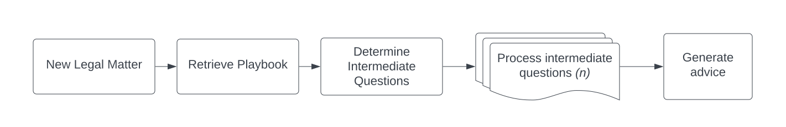

In this post I'll describe how the following all-JavaScript application stack excells with language model (LM) heavy workloads:

- [Qwik](https://qwik.builder.io/): A cutting edge, high performance web application framework;
- [BullMQ](https://bullmq.io/): Background job processing;
- [Redis](https://redis.io/): in-memory datastore;
- [PostgreSQL](https://www.postgresql.org/): relational, persistant database;
- [OpenAI API](https://openai.com/): language model API.


I walk you through how this application architecture works at a high level. To illustrate this I provide some code snippets. This blog post is not about writing production application code and the code snippets are not production quality. This blog post would be far too long and difficult to follow otherwise. I am specifically not covering type safety, database connection pooling, etc.

## Using LMs to provide legal advice
Imagine an LM based application that can give legal advice to startups. Let's say a startup accidentally hired the wrong person into a C-Suite role and needs to do a termination. How do they go about that?

First, the application needs to determine how to answer this question. Let's imagine we have a dataset of legal analysis the app can use for this. We make several LM calls to determine the parameters to search the dataset. Then we use the LM to determine if the search results are relevant to the question. Next we use the language model to review the data and determine what facts it needs to provide an answer (let's call these intermediate questions). For this example, the LM will have 10-15 intermediate questions about employee demographics, equity grant details, and the reason for the termination. For each question, we again use the LM to determine which facts can be gathered programatically from APIs (e.g. employee demographics from the company's Rippling HR system; equity info from the company's Carta account) and which have to be answered by a human (the reason for the termination).

We use the LM to create the API requests and to craft a question to the human. Then we use the LM to convert the data into the correct format for the database. Finally, we make one last LM call providing the question, the facts we gathered, and relevant legal analysis from our dataset to generate the advice. This last request generates a lot of text and easily takes over 30 seconds on its own. All-in-all we made about 50 requests to various LMs via the OpenAI API to generate some legal advice.

This gives you a good idea of what I mean by LM heavy workloads. I won't walk through every use case mentioned above. We'll cover just the basics to get the idea across of how to use this application architecture.

## The challenges of working with LMs
There are a few key challenges with building applications on top of LM APIs. These are not novel challenges in software engineering, but they are a bit different than your typical application.

The first challenge is that LMs can be slow. It is common for requests to LM APIs to take several seconds. This means we can't put LM API calls in the critical path—nobody wants to wait multiple seconds for a web page to load.

A second challenge is that LMs are not great with complexity. An easy task for humans needs to be broken down into multiple smaller tasks for an LM.

Lastly, today's LM APIs can be a bit flaky. LM APIs are a pretty new technology and because of this they can sometimes feel a bit like a prototype. I have seen higher error rates and lower availability than more established production grade services

## Getting setup in Qwik & BullMQ
Let's create a [Qwik route](https://qwik.dev/docs/routing/) where the user can enter the legal question. In the route action we'll insert the question into the database and then create a BullMQ job to process it.

*/qwik-app/src/routes/matter/new/index.tsx*:
```js
import { component$ } from "@builder.io/qwik";
import { routeAction$, Form } from "@builder.io/qwik-city";
// Import configured Postgres client via "postgres" npm module
import { sql } from "./utils/database";
import { Queue } from "bullmq";
// Import setup Redis client via npm "ioredis" module
import { ioRedisConnection } from "./utils/redis";

export const useCreateMatter = routeAction$(async (data, requestEvent) => {
  // SQL query to create the matter
  const newMatter = await sql`
    INSERT INTO "matter"
      ("question")
        VALUES
          (${data.question})
            returning "id", "question";
  `;

  // Setup the BullMQ queue so we can drop a job into it
  const processMatterQueue = new Queue("ProcessMatter", {
    connection: ioRedisConnection,
  });

  // Add the new job to the queue
  await processMatterQueue.add("New matter", {
    matterId: newMatter[0]?.id,
    question: newMatter[0]?.question,
  });

  // Redirect the user to the route to display the matter/question
  throw requestEvent.redirect(302, `/matter/${newMatter[0]?.id}`);
})

export default component$(() => {
  // Our route action is used for the form action
  const action = useCreateCase();
  return (
    <Form action={action}>
      <label for="about">Enter your question</label>
      <textarea id="question" name="question"></textarea>
      <button type="submit">Save</button>
    </Form>
  )
})
```

Here's the beginning of our page that shows the answer to the legal question. Note that we haven't written any code to generate the advice so nothing will render inside the `p` tag of the component yet.

*/qwik-app/src/routes/matter/[id]/index.tsx*:
```js
import { component$, routeLoader$ } from "@builder.io/qwik"
import { sql } from "../utils/databse";

// Load the advice from the database for the initial pageload
export const userAdviceData = routeLoader$(async (requestEvent) => {
  // Get the userId
  const userId = requestEvent.cookie.get("userId")

  // Get the case entity ID
  const matterId = requestEvent.params["id"]

  const adviceQuery = await sql`
    SELECT "content" FROM "advice" WHERE "id" = ${matterId} AND "userId" = ${userId};
  `
  return {
    adviceQuery: advice[0]
  }
})

export default component$(() => {
  // Get the route's loader data and make it into a signal for the initial page load
  const signal = useCaseData()

  // Render the component with the advice
  return (
    <p>{ advice.value ? advice.value : "" }</p>
  )
})
```

## Background job processing
Here's where things get a little complex! When a new legal case is created, we need to retrieve the playbook so the LM can determine what intermediate questions it needs answers to. Each intermediate question is going to have its own set of LM operations until it gets answered. We won't cover all those LM calls here. Instead, below we'll cover just the worker that retrieves the playbook and uses the LM to create the intermediate questions.



As mentioned above, the LM API calls can take a while and we need to make many of them. Our page load times could exceed a full minute if we make the LM API requests while rending a page. We also can't make the requests in the browser because we need to hide our API key from the site visitors. We could use Qwik as a proxy to OpenAI so that we could execute the LM requests from the browser while hiding our API key. The biggest drawback here is that we'll be locking up threads on our main web server for several seconds at a time. To make sure the app can scale load, we want to keep everything in the ciritcal path on the main web server super zippy. Another drawback is that we'd be moving tons of our application logic to the browser. Now everyone can see our proprietary code and the browser is working overtime. All-in-all not a good idea.

A good solution to this problem is to move the LM workload to background jobs. This allows us to remove the long blocking time of LM calls from the critical path (no long page loads). It also allows us to parallelize the LM calls to speed up the generation of the legal advice. [BullMQ](https://bullmq.io/) is a full-featured solution that fits the bill. I won't go into too much detail here but with BullMQ we can:

- Make the LM API calls in background jobs addressing the LM latency problem;
- Retry failed LM jobs addressing the LM API flakyness;
- Rate limit jobs to address OpenAI API rate limits (will cover this in another blog post);
- Parallelize the LM calls, further addressing the latency problem.

It will take far too long to write all the LM workers mentioned in the legal use case above. We'll use some shorthand to skip ahead. Let's assume that we already have a worker that processed the initial legal question and created the 10-15 follow up questions to get the information it needs to answer the legal question. In this example below, we have a worker that uses an LM to determine if one of the follow up questions can be answered by either the Carta or Rippling API. I'm taking a lot of shortcuts here for brevity. Normally you'd do a lot of quality checking on the response from the LM before writing the response to your database.

```js
import OpenAI from "openai";
import { Worker } from "bullmq";
import { tools } from "./tools";
import { sql } from "../utils/sql";
// Already configured openai client
import { openai } from "./utils/openai";
// Already implemented retrieval-augmented-generation (RAG) that retrieves the proper playbook on how to answer the legal question
import { getPlaybook } from "./utils/playbook";

const worker = new Worker('ProcessMatter', async job => {
  // Get the playbook on how to answer the legal question
  const playbook = await getPlaybook(job.data.question)

  // Ask the model how to answer the question
  const completion = await openai.chat.completions.create({
    messages: [
      {
        role: 'user', 
        content: `Use the following playbook to determine what questions, if any, need to be answered before the legal question can be answered.

        Desired response format is JSON:
        {
          "questions": [
            {
              "content": "question here",
              "matter_id": ${job.data.matterId}
            }
          ]
        }

        Question:"""
        ${job.data.question}
        """

        Playbook:"""
        ${playbook}
        """
        `
      }
    ],
    model: 'gpt-3.5-turbo',
    responseFormat: { type: "json_object" }
  });

  const answer = JSON.parse(completion.choices[0].message.content);

  // Save the response to the database
  const newQuestions = await sql`
    INSERT INTO "question" ${ sql(answer.questions) } RETURNING "id", "content", "matter_id";
  `

  // Setup the BullMQ queue so we can drop jobs into it to process each question
  const processQuestionQueue = new Queue("ProcessQuestion", {
    connection: ioRedisConnection,
  });

  // Create an array of questions formatted for the queue.bulkAdd BullMQ feature
  const bulkQuestions = newQuestions.map((question) => {
    return {
      name: "processQuestion",
      data: {
        id: question.id,
        matterId: question.matter_id,
        content: question.content
      }
    }
  })

  // Add the new jobs to the queue
  await processQuestionQueue.addBulk(bulkQuestions)

  // Close the Redis connection in the worker
  await createQuestionsQueue.close();

  // Return something - optional
  return {
    newQuestions
  }
});
```

## Making the application real-time reactive
Let's skip ahead a few steps and assume that this point all the intermediate questions have been answered. I mentioned above that the final LM call that generates legal advice can take 30 seconds or longer. It would be a better user experience if we could stream the LM completion to the browser. This way the user is seeing a ChatGPT type experience where the text appears in the UI piece-by-piece. But our LM requests are happening in a background job so how can we stream them to the browser?

Enter Postgres [listen/notify channels](https://www.postgresql.org/docs/current/sql-listen.html) and [triggers](https://www.postgresql.org/docs/current/triggers.html). We'll execute a SQL `UPDATE` query on the table that contains our legal advice each time we receive a chunk of text from the LM. We'll also configure a Postgres trigger function to run on every `UPDATE` that publishes the text from the LM to a channel that clients can listen on. Now in our Qwik backend we can listen on the channel with our Postgres client and steam all the channel messages down to the browser. Let's see some code.

**Postgres trigger function + channel**

In this PostgreSQL code block we define a Postgres trigger function. The function has access to a `NEW` variable which is the value of the row after it was updated. It uses the `NEW` data to construct a JSON object of all the data we need and sends the object as the payload on the channel.
```sql
CREATE OR REPLACE FUNCTION advice_mutation_trigger() RETURNS TRIGGER AS $question_mutation$
  DECLARE
    payload TEXT;
  BEGIN
    payload := json_build_object(
      'entity', 'advice',
      'userId', NEW."user_id",
      'id', NEW."id",
      'complete', NEW."complete",
      'advice', NEW."content"
    );
    PERFORM pg_notify('advice_mutation', payload);
    RETURN NULL;
  END;
$question_mutation$ LANGUAGE plpgsql;
```

In this PostgreSQL code block we apply the function to the "advice" table and ensure that it executes on every `INSERT` and `UPDATE`.
```sql
CREATE TRIGGER advice_mutation AFTER INSERT OR UPDATE ON "advice"
  FOR EACH ROW EXECUTE FUNCTION advice_mutation_trigger();
```

**Streaming OpenAI API worker**

In this JavaScript code block we create a BullMQ worker that makes a streaming OpenAI API request and saves each chunk to the database:
```js
import OpenAI from "openai";
import { Worker } from "bullmq";
import { tools } from "./tools";
import { sql } from "../utils/sql";

const openai = new OpenAI({
  apiKey: process.env['OPENAI_API_KEY'],
});

const worker = new Worker('foo', async job => {
  // Variable to the hold the stream chunks
  let completion = ""

  // Create the stream
  const stream = await openai.chat.completions.create({
    model: 'gpt-4',
    messages: [
      { 
        role: 'user',
        content: `Use the following playbook and facts to generate an answer to the question.
        
        Playbook:"""
        ${job.data.playbook}
        """

        Facts:"""
        ${job.data.facts}
        """

        Question:"""
        ${job.data.question}
        """
        `
      }
    ],
    stream: true,
  });

  // Handle each chunk in the stream
  for await (const chunk of stream) {
    // Concat the chunk to the full completion
    completion += chunk.choices[0]?.delta?.content || '';

    // Save it to the database
    await sql`
      UPDATE "advice"
        SET "content" = ${completion}
          WHERE "id" = ${job.data.caseId};
    `
  }

  // Once we're finished, set the state of the advice to complete
  await sql`
    UPDATE "advice"
      SET "complete" = true
        WHERE "id" = ${job.data.caseId};
  `

   // Optional: Return the data when the stream is done
   return {
    ...job.data,
    advice: completion
   }
});
```

A few side notes. I think in general it's a good idea to write each chunk you receive to the database because you never know if the stream will terminate (network error, OpenAI error, etc.) before the completion is done. This helps to prevent data loss. Additionally, I want to note some limitations with the channel payload from the [Postgres docs](https://www.postgresql.org/docs/current/sql-notify.html#:~:text=In%20the%20default%20configuration%20it,the%20key%20of%20the%20record.):

> ...This must be specified as a simple string literal. In the default configuration it must be shorter than 8000 bytes. (If binary data or large amounts of information need to be communicated, it's best to put it in a database table and send the key of the record.)

**Listening for notifications on the channel**

Now we can use the Qwik backend and Postgres client to listen for notifications on the channel. In this code block, we use the `server$` function to create a [readable stream](https://qwik.builder.io/docs/server$/#streaming-responses) for our JavaScript running in the browser to listen to. Within the server function we listen for notifications on the "advice_mutation" Postgres channel that our Postgres trigger publishes to. We inspect the notification payload to make sure it matches the currently loaded case ID and the currently authenticated user ID. Then we send the data down to the client. The client receives the data and updates the [signal](https://qwik.builder.io/docs/components/state/) that the component renders.

```jsx
import { server$ } from "@builder.io/qwik-city";
import { component$, useVisibleTask$, routeLoader$ } from "@builder.io/qwik"
import { sql } from "../utils/sql";

// Load the advice from the database for the initial pageload
export const userAdviceData = routeLoader$(async (requestEvent) => {
  // Get the userId
  const userId = requestEvent.cookie.get("userId")

  // Get the case entity ID
  const caseId = requestEvent.params["id"]

  const adviceQuery = await sql`
    SELECT "content" FROM "advice" WHERE "id" = ${caseId} AND "userId" = ${userId};
  `

  return {
    adviceQuery: advice[0]
  }
})

// Qwik server function
const stream = server$(async function* (requestEvent) {
  // Get the userId
  const userId = this.cookie.get("userId")

  // Get the case entity ID
  const caseId = this.params["id"]

  // A simple "sleep" function
  const wait = (ms: number) => new Promise((resolve) => setTimeout(resolve, ms));

  // Hold each notification payload on the channel into a queue
  const queue: string[] = [];

  // Variable to determine if the advice lifecycle is complete
  let adviceComplete = false;

  // Listen on the channel and push each notification payload into the queue
  const pgListen = await sql.listen("advice_mutation", (payload) => {
    const data = JSON.parse(payload)
    
    // Only process notification payloads that match the currently loaded caseId and are owned by the current userId
    if (data.id === caseId && data.userId === userId) {
      // Update the variable on the advice lifecycle
      adviceComplete = data.complete;

      // Add the notification payload to the queue
      queue.push(data.data.advice);
    }
  });

  // Keep checking for new payloads in the queue
  while (true) {
    if (adviceComplete) {
      // If the advice lifecycle is complete, end the pg listen
      await pgListen.unlisten()

      // End the readable stream to the browser
      break;
    }
    if (queue.length > 0) {
      // Grab the first payload in the queue
      const data = queue[0];
      // Remove the first payload from the queue
      queue.shift();
      // Send the payload down to the client
      yield data;
    }
    // Repeat the process every 25 miliseconds
    await wait(25);
  }
});

export default component$(() => {
  // Get the route's loader data and make it into a signal for the initial page load
  const signal = useCaseData()

  // Start a readable stream on page load to stream any mutations on the advice 
  useVisibleTask$(async () => {
    const adviceMutationStream = await stream();
    // Loop through each chunk of the stream
    for await (const chunk of adviceMutationStream) {
      // Update the signal with the new advice data
      signal.vallue = chunk;
    }
  })

  // Render the component with the advice
  return (
    <p>{ advice.value }</p>
  )
})
```

One note here: If the advice is already fully generated from the LM we do not need to open a socket to our web server and listen for changes. To keep things simple in the explanation I did not include this logic.

## Conclusion

As you can see, with this application stack, we can create an application with LM heavy workloads and a fantastic real-time, streaming user experience. There are pros and cons to every approach and I'd like to be transparent about those here.

### Pros

One of the biggest pros with this stack is that it's all one langugage. Many of us are used to switching between language daily, but I do think it reduces mental overhead if you can converge on one language.

Another pro is that BullMQ has a [Pro](https://bullmq.io/#bullmq-pro) offering which gives you a ton of extra features and a full-blown web UI for observability into your gueues. I know some will balk at the cost of this and that's fair. If you want something free you can convert your workers to Python and use [Celery](https://docs.celeryq.dev/en/stable/getting-started/introduction.html) jobs with [CloudAMQP](https://www.cloudamqp.com/), a hosted [RabbitMQ](https://rabbitmq.com/) service for your Celery workers.

### Cons

One of the big cons with this all JavaScript application stack is that the ML/AI community is Python centric. There are a lot of powerful libraries out there that only exist in Python. As the complexity of your LM based application grows it's likely you will not be able to avoid writing and executing Python code. In this case you'll probably want Python workers instead of JavaScript workers. BullMQ is working on Python support, but it's not production ready [yet](https://docs.bullmq.io/python/introduction).

## Other considerations

With this streaming architecture you need to keep sockets open from the browser to your Qwik backend and a socket open from the Qwik backend to your database. Sending messages back and forth over an open socket is far more efficient than doing some sort of polling against the backend with HTTP requests and polling your database. You'll need to monitor how many open sockets your Qwik server(s) and Postgres servers can handle. There's many other pub/sub options out there is you reach a load that pushes Postgres to its limits. I think this is unlikely for the overwhelming majority of applications out there. There's tons of strategies to scale Postgres in the cloud (connection pooling, vertical scaling, horizontal scaling, sharding, etc.) before moving to a different pub/sub solution.